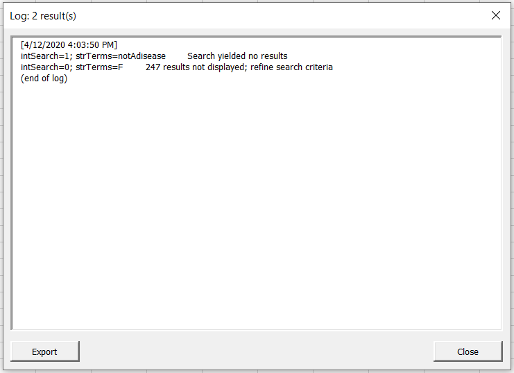

# ICD-10-CM 2020 API for Excel VBA
## Purpose and Features
- Demonstrate [NIH Clinical Table Search Service API for ICD-10-CM 2020](https://clinicaltables.nlm.nih.gov/apidoc/icd10cm/v3/doc.html) usage within VBA framework
- Create a userform to assist in querying multiple searches 
## Compatibility
- Microsoft Excel 2010+ (OS must be able to support Regular Expression, Dictionary, and XMLHTTP objects)
- Note: I am working on translating this respository to Javascript for Google Sheets
## How It Works
1. The ICD-10-CM API is called with the XMLHTTP object
2. The XMLHTTP object returns a JSON script
3. The JSON script is parsed using code found [here](https://github.com/omegastripes/VBA-JSON-parser)
4. The items in the parsed JSON script are added to a dictionary object
5. Steps 1-4 are repeated for all search queries
6. The dictionary object is written to an Excel worksheet
## Usage
Download 'ICD10 API.xlsm'

The current file has one function and three macros:
- `getICDdesc()` is a function that searches an ICD description given an ICD code
- `OpenQueryForm` is a sub that opens a userform which supports searching multiple terms (combination of codes and names)
- `printICDbyCode` is a sub that searches a single ICD code
- `printICDbyName` is a sub that searches a singe ICD description
## Sample Images

